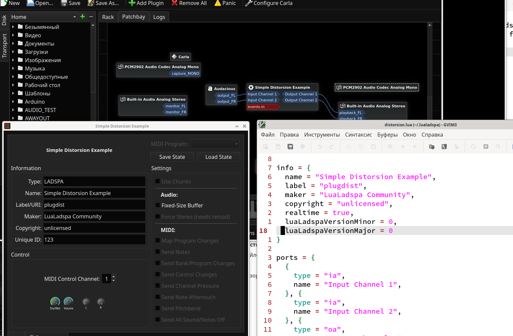
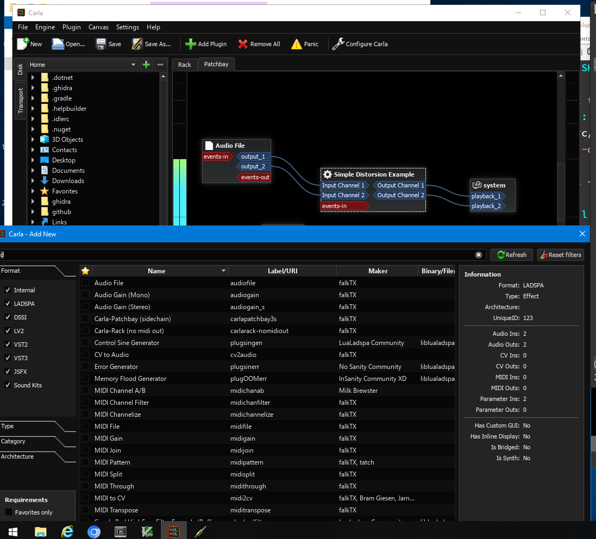

# LUALADSPA

## General info

Lualadspa is a very powerful ladspa plugin, that gives you ability to write a lot of kinds of ladspa audio plugins in Lua - the best dynamic language, in my opinion.

Your plugins are simple lua files, that contain all info about plugin and all plugin's methods. Version check and plugin information validation are already implemented.



Every plugin is runned as separate and independent virtual machine, btw.

**WARNING! This project is still in early development, aka it may be not very usable in production!** But it would be wonderful, if you will contribute in this project in some way (by writing plugins, or using it's plugins, writing documentations as examples). Also TODO list may be found in `TODO.md file`.

## Tested and supported platforms and hosts

- Windows : Carla + Jack 2.0


- Linux : Carla, Audacity

## Luau, available libs, API and so on...

`print` function was changed, to write output not to stdout, but to lualadspa log file. All semantics are same.

### \_G.ladspa

`_G.ladspa` is lualadspa library API for lua.

`ladspa.getVersion` returns current version of lualadspa (major and minor) as numbers. Recieves zero arguments.
```lua
local vmaj, vmin = ladspa.getVersion()
```

`ladspa.getSampleRate()` returns samplerate setted when plugin was initialized. It will not be changed during plugin runtime, so you can cache this result. Recieves zero arguments.

`ladspa.getMemoryUsage()` returns float value between 0.0 and 1.0. Represents how much memory is used by current lua state.
For debugging purposes.

### Audio Buffers (in \_G.ladspa too)

**AudioBuffer** is a userdata object, that contatins audio data.
It may have size, or be a reference to a single value.
AudioBuffer can be **internal** (created in lua) or **external** (passed in by HOST). HOST buffers do not consume any memory, while internal buffers do, and do very much :) 
Internal buffers can be resized by lua, external **CAN NOT**. Host decides when to resize external buffer and do all this stuff. You should not care about this.

`ladspa.newBuffer(size)` creates new audio buffer with specified size.
Recieves size argumrnt - size of your auduio buffer, aka number of elements in it. Returns new **AudioBuffer**.

`ladspa.resizeBuffer(buffer, newsize)` changes size of given buffer.

Indecies are numbers in range `1..BUFFER\_SIZE`. You should remember size of your buffer, size of external buffers is given as fist argument to `run()` function. 
**HINT:** Last index is the size of the buffer :)

`AudioBuffer[ind]` *aka __index metamethod* used to **GET VALUE** from audio buffer at specified **INDEX**. Out of bounds access is **NOT DETECTED IN RELEASE VERSION, AND WILL CAUSE UNDEFINED BEHAVIOUR**, be careful.

`AduioBuffer[ind] = value` as you can understand, will **SET** value at specified index in the buffer. Out of bounds access is **NOT DETECTED IN RELEASE VERSION, AND WILL CAUSE UNDEFINED BEHAVIOUR**, be careful.

### Function/fields you must/should implement for your plugin

I can dublicate all this stuff, but i will not.
Read [this example plugin](plugins/mixer.lua) to gell ALL this information, and even more.

## Example

See `./plugins/mixer.lua` for exaple of such plugin.

# Building/Instalation instruction

todo

# For Contributors

## Implementation details

Your plugin file could be loaded in two states : master state and plugin state. Theese states are invinsible for plugin developer as long, as he
not tries to do some dirty stuff :)
Main state is created to parse/get all main information and provide it to LADSPA_* interfaces for LADSPA HOSTS. Also it keeps precompiled main chunk.
Each time when new instance of your plugin is created - it is created in PLUGIN state itself, with invinsible, unavailable from Lua directly, link to the master state.

Actually, for efficiency, master state are used just as anchors for all GC objects, that represents plugin info, while this plugin info is already getted from state and saved for easy access in readonly pointers, so it can
be used without expensive locks in multithreaded enviroment.

Master state can even dissapear at some time in future, but i am not sure...

Master state has another one purpose : it runs internal bytecode, that does
all this dirty "getting/caching values from lua state to C", validates plugin info and so on. It was really much easier to implement in lua, than in C/C++.

Also, this gives us ability to limit maximal memory usage per plugin state.
I am still not sure what this limit should be. Now it's 32 Mb.

`_G.ladspa` table contains some useful functions for your plugins - version info, creating/resizing CUSTOM AUDIO BUFFERS (*needs testing*), getting current samplerate and so on.
They are actively uses registry table internally.

**AND REALLY IMPORTANT NOTE :** lualadspa uses **NOT VANILLA LUA, BUT LUAU -** customized lua distributon for SAFE embedding + with much better VM/Compiler, while keeping a whole codebase on C/C++ => still being as portable, as C/C++ (this is where luajit sucks :D).

While safe embedding is still just cool addition, faster interpreter is really important, to minimize audio flows/gaps and other shit.
I know that luajit WILL be faster, but at the same time... There may be some dragons.

# Known Issues
- Plugin hosts don't like when plugin's index is changing at runtime... I don't know why, but some hosts may even crash because of this.
- SOMETIMES (expirienced only on Carla) host may crash by itself, and i dunno why.
- Sometimes plugin hosts likes very much to call `__free()` on shared library and unload all loded and compiled plugins - this means that any sort of plugin usage become disaster on perfomace, and this may not be fixed, but i will try to minimise load time as much, as i could later.
